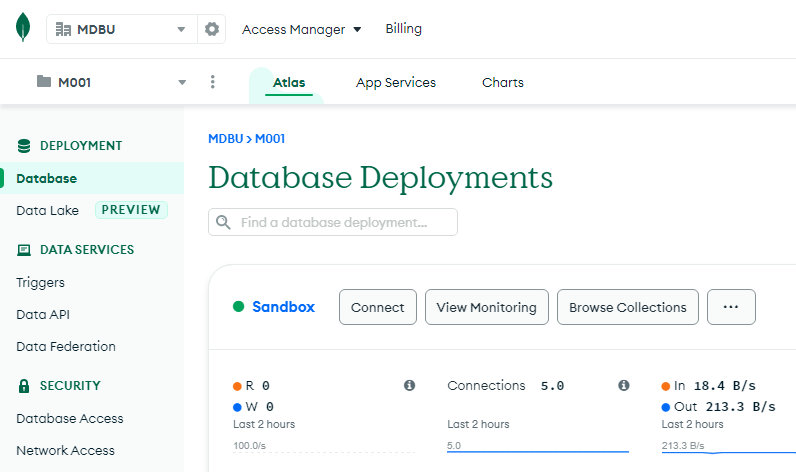
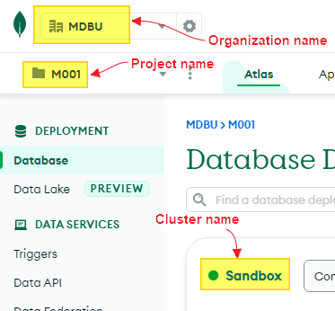

# MongoDB Learning Notes

July 12, 2022

The note bases on MongoDB version 5.0

## MongoDB Cloud Platform - Atlas

MongoDB has a cloud platform named Atlas. Here is the [entrance](https://cloud.mongodb.com/).

### Database/Cluster structure on the cloud

- Organization(s)
  - Project(s)
    - Cluster(s)
      - Database(s) (will not be displayed on the page)

Atlas provides user **M0 shared cluster** for free.

## MongoDB Shell

Also known as **mongosh**. It is the tool for the connection to the cluster built on Atlas. [Download link](https://www.mongodb.com/products/shell).

### Connection string is used for connection from MongoSH

Log in Atlas, and go to the Database page, you may find a button "Connect" beside your cluster name. Here, mine is "Sandbox". Click on the button "Connect". And choose "Connect with MongoDB Shell" option.

And then, choose "I have the MongoDB Shell installed", and the option "mongosh" from the dropdown list.

When you finish the above selection, you may find the connection string generated at the lower part of the page.

Copy the connection string from the page.

Open the command line terminal on your system.

Enter the connection string after the command line prompt.

Once connection completed, you may see the following information.

## Commands

### Show current database (connected to)

**db**

**\<tab\>** - Enter tab key to show all commands.

**show dbs** - List all existed databases in the system.

**use <database_name>** - Switch to the specified database.

**show collections** - Show all collections that current database contains.

