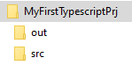

# Npm Learning Note

[TOC]

## What is Npm?

Npm, as its name describes, it stands for "**Node Packages Manager/management**". So far, Npm is deemed as the front-end packages/dependencies manager that manages thousands millions JavaScript-based packages/resources around the world. If you are a Java developer, you may think that it plays the role the same Maven does in the Java world.

## Installation

Npm, generally, will be installed along with NodeJS. Check the [link here](https://nodejs.org/en/download/) to install NodeJS first then you will get the Npm installed on your system.

## Version

This note takes down all the things that I've learned during my journey of using Npm. The version of my Npm installed is `8.8.0`. You may use the following cmd to check the version of Npm. Btw, my NodeJS version is `v16.13.1`.

```shell
# In a shell/commandline/bash
> npm -v
```

## Generate package information for your project

You may use Npm to initialize your project workspace. For example, I have a project named **MyFirstTypescriptPrj**. Then, I will use Npm as the project packages manager to generate a package descriptor, that is, `package.json` file. So I need to do the following things:

1. Create the project folder as its workspace.

    ```shell
    > mkdir MyFirstTypescriptPrj
    ```

    Go to the project folder.

    ```shell
    > cd MyFirstTypescriptPrj
    ```

2. Run Npm init command to initialize the workspace.

    ```shell
    MyFirstTypescriptPrj> npm init
    ```

    For more information about how to use `npm init`, please refer to https://docs.npmjs.com/cli/v8/commands/npm-init.

3. Answer questions that Npm needs to initialize.

    The questions are:

    - package name

        The current folder name will be adopted as the default package name if you enter directly without any input.

    - version

        The version 1.0.0  is as the default.

    - description

        It can be empty.

    - entry point

        Here you can indicate the file that will be called firstly when the package/application is running. Usually, it is `index.js`. As we are used to put our compiled resources/packages in a folder named `out`, as a result, the value `out/index.js` may be applicable. The following picture shows a possible project structure that I will use for the `MyFirstTypescriptPrj`.

        

        The folder `out` is defined as the target folder that will be used to contain all the compiled resources and packages. At later sections of this document, you may find how to define such folders manually.

    - test command

        Here with this item, you can indicate a snippet of script for testing purpose. For example, in my project, I will use the module `mocha` as a test suite, so here I will specify the test command as `mocha --reporter list`. After that, when I execute the command `nmp test` in a CLI for my project, I will get the mocha test reporter in the list format. *Surely, there are many other things to do to involve a test suite/framework in your project but not simply go with a line of code :-)*.

    - git repository

        By this item, you can specify your git repository URL. For example, `https://github.com/myrepositories/MyFirstTypescriptPrj.git`. The item is just the information of your project git repository, no more than that. You can leave it empty. However, it will be very helpful for other developers reference when you publish your packages onto a public package registry.

    - keywords

        The keywords you set for your package will be indexed by the public registry server. It may help to the accurate package searching for others.

    - author

        *Should I say something about this?*

    - license

        [Check here](https://en.wikipedia.org/wiki/Software_license)^[1]^ for more information.

    After all above steps, you may find a file `package.json` has been generated in the project folder. It may look like the following:

    ```JSON
    {
      "name": "myfirsttypescriptprj",
      "version": "1.0.0",
      "description": "",
      "main": "out/index.js",
      "scripts": {
        "test": "echo \"Error: no test specified\" && exit 1"
      },
      "repository": {
        "type": "git",
        "url": "git+https://github.com/myrepositories/MyFirstTypescriptPrj.git"
      },
      "keywords": [
        "typescriptdemo"
      ],
      "author": "Foo Bar",
      "license": "ISC",
      "bugs": {
        "url": "https://github.com/myrepositories/MyFirstTypescriptPrj/issues"
      },
      "homepage": "https://github.com/myrepositories/MyFirstTypescriptPrj#readme"
    }
    ```

    

# Reference

1. Software License

    https://en.wikipedia.org/wiki/Software_license

2. 