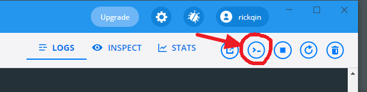
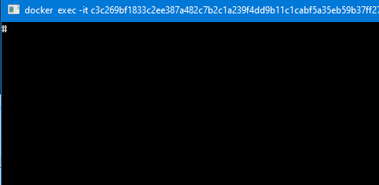
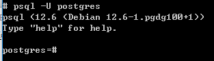

# Postgres Basic Operations

Env: Docker on Lenovo (local img: postgres-0)

PostgreSQL version: PostgreSQL 12.6 (Debian 12.6-1.pgdg100+1)

## Operations on Docker (Enter into Psql console)

### Enter Psql console

After the postgres image started successfully, you may open the psql console by clicking the console button on the Docker's GUI toolbar. See picture as follows:

Then, a terminal comes out and you may see a "**#**" at the top left corner in the terminal. The symbol "**#**" means you are now in Psql bash.

Enter "**psql -U postgres**" in the terminal to switch to the user "postgres" like the picture shown below.

That's it. Now you are in the Psql console and you can do tasks of postgres.
